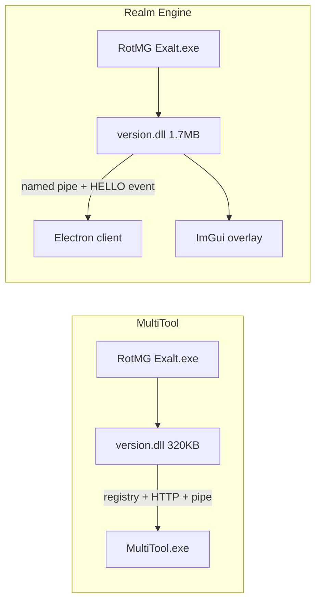

# MultiTool version.dll vs Realm Engine version.dll

Comparison of RealmStock MultiTool 1.41.0 `version.dll` against Realm Engine
`internal/` output. Static analysis from PE headers, export tables, ASCII
strings, source-code hook inventory, and prior BinaryNinja notes on MultiTool
(`ProjNoclip.cpp` references `sub_180007380` / `sub_180007400`).

Tools live in [`internal/tools/dll-compare/`](../tools/dll-compare/).

---

## 1. PE summary

Measured on Windows during initial static pass (Sep 2026):

| | MultiTool | Realm Engine |
|---|---|---|
| Path | `MultiTool_1.41.0/MultiTool_Data/version.dll` | `client/assets/version.dll` |
| Size | 320,512 bytes | 1,745,408 bytes |
| Arch | x64 | x64 |
| Sections | 9 (.text, .rdata, .data, .pdata, **.detourc**, **.detourd**, .fptable, .rsrc, .reloc) | 8 (.text, .rdata, .data, .pdata, **.detourc**, **.detourd**, .rsrc, .reloc) |
| Proxy exports | 17 `version.dll` forwards | Same 17 |

Re-run locally:

```bash
python3 internal/tools/dll-compare/analyze_pe.py \
  "$MULTITOOL_DLL" "$REALMENGINE_DLL"
```

---

## 2. Imports and hook libraries

### MultiTool (inferred from PE + strings)

| Signal | Present |
|---|---|
| MS Detours (`.detourc`/`.detourd`) | yes |
| MinHook (`MH_CreateHook`, `MinHook`) | **no strings found** |
| ImGui | **no** |
| IL2CPP API imports via `GetProcAddress` | yes (~15 `il2cpp_*` strings) |
| HTTP client | yes (`System.Net.Http`, `HttpContent`, `ReadAsStringAsync`) |
| Registry IPC | yes (`SOFTWARE\RealmStock\MultiTool`, `RegNotifyChangeKeyValue`) |
| WinHTTP / Winsock | likely (HTTP to companion exe) |

Import DLLs (typical for this size): `KERNEL32`, `USER32`, `ADVAPI32` (registry),
`WS2_32` or WinHTTP stack, MSVC runtime. No D3D11/DXGI static linkage (smaller
.text than ours).

### Realm Engine (from source + PE)

| Signal | Present |
|---|---|
| MS Detours | yes (`InitHooks.cpp`, Present hook) |
| MinHook | yes (IL2CPP method hooks) |
| ImGui + DX11 | yes (linked into DLL, large `.data`) |
| IL2CPP | yes (`il2cpp-init.cpp`) |
| IPC | named pipe client (`IpcBridge.cpp`), not HTTP |
| Companion | Electron client (optional for full feature set) |

---

## 3. Architecture



### MultiTool startup (inferred)

1. `DllMain` -> proxy-load real `System32\version.dll`
2. Worker thread waits for `GameAssembly.dll`
3. Resolve IL2CPP via `GetProcAddress`
4. Check MultiTool.exe is running (registry / HTTP); error if not:
   `ERROR: MutliTool is not running, proxy server will not be present.`
5. Install Detours hooks (Present + game methods)
6. Read settings from MultiTool.exe over HTTP; no in-game UI in DLL

### Realm Engine startup

See [`internal/src/bootstrap/version.cpp`](../src/bootstrap/version.cpp):

1. Proxy `version.dll` exports
2. Poll `GameAssembly.dll` (60s)
3. Wait on `Local\LFGInternalHelloReady` (sniffer HELLO, 30s timeout)
4. `Run()` -> IL2CPP init -> Present detour -> ImGui loop
5. IPC pipe to Electron for feature commands

---

## 4. Hook inventory (side by side)

### Shared / overlapping hooks

| Feature | MultiTool (strings + BN notes) | Realm Engine (source) |
|---|---|---|
| Proxy load | 17 `version.dll` exports | [`version.cpp`](../src/bootstrap/version.cpp) |
| Present / render tick | Detours (no ImGui) | Detours -> [`DirectX.cpp`](../src/platform/hooks/DirectX.cpp) |
| Auto aim | `AutoAimEnabled`, `AutoAimMode`, `AutoAimFocusBoss`, `AutoAimIgnoreWalls`, `AutoAimMouseDist`, `AutoAimRangeLead`, `AutoAimShootInvulnerable`, `AutoAimShootWhileStealthed` | [`AimHooks.cpp`](../src/features/combat/autoaim/AimHooks.cpp): ComputeShootAngle, ShootWithAngle, SendShotPacket |
| Projectile noclip | `WeaponModsProjectileNoclip`; BN `sub_180007380`/`sub_180007400` | [`ProjNoclip.cpp`](../src/features/combat/autoaim/ProjNoclip.cpp): `GJFKGLJEGKO` + `IACODGNOFMH` (documented as matching MultiTool) |
| Speedhack bypass | `SpeedHackDetector`, `SpeedHackDetector.Update` | [`SpeedHack.cpp`](../src/features/movement/speedhack/SpeedHack.cpp): skips `SpeedHackDetector::Update` + Time icall detours |
| IL2CPP init | `il2cpp_init`, `il2cpp_class_from_name`, ... | [`il2cpp-init.cpp`](../src/core/il2cpp/il2cpp-init.cpp) |

Full Realm Engine hook list: [`realm_engine_hooks.json`](../tools/dll-compare/realm_engine_hooks.json).

### MultiTool-only (visible in DLL strings)

| Feature | Evidence | Realm Engine |
|---|---|---|
| ObscuredCheatingDetector bypass | `ObscuredCheatingDetector`, `OnCheatingDetected`, `Failed to find ObscuredCheatingDetector` | **Not implemented** |
| SlowWalk | `SlowWalkHold`, `SlowWalkKey`, `SlowWalkMultiplier`, `SlowWalkPercentOrSpeed` | **Not in DLL** |
| FPS override | `FpsBackground`, `FpsForeground`, `FpsVsync`, `set_targetFrameRate`, `set_vSyncCount` | Partial: [`FpsSetter.cpp`](../src/features/misc/FpsSetter.cpp) exists but not same string surface |
| Device fingerprint | `GetDeviceUniqueIdentifier` | [`HwidCapture.cpp`](../src/features/account/HwidCapture.cpp) (different approach) |
| External UI | `MultiTool`, `RealmStock`, HTTP to exe | Electron dashboard + ImGui |

### Realm Engine-only (not in MultiTool strings)

| Feature | Source |
|---|---|
| Dodge stack (XDodge, RollGrid, RollQuad, ZDodge, RePP, PJDodge) | `internal/src/features/movement/` |
| AutoNexus, GhostHit, BagLooter, native AutoAbility | combat + loot features |
| SkinChanger, FloatingText | visuals |
| BootGate + RuntimeOffsets self-healing | `RuntimeOffsets.cpp`, `BootGate.cpp` |
| ImGui menu (6 tabs) | `gui/tabs/` |
| MCP DiagBridge | `DiagBridge.cpp` |
| CredentialCapture / CharSelect hooks | account features |
| Anti-debug unload (Release) | `main.cpp` SecurityWatcherThread |

---

## 5. MultiTool.exe IPC protocol (static)

MultiTool's DLL is not standalone. Observed integration points:

| Mechanism | Detail |
|---|---|
| Registry | `HKLM/HKCU SOFTWARE\RealmStock\MultiTool` via `RegOpenKeyExA`, `RegCreateKeyExA`, `RegSetValueExA`, `RegGetValueA`, `RegNotifyChangeKeyValue` |
| HTTP | `System.Net.Http`, `HttpContent`, `ReadAsStringAsync` (likely localhost REST from MultiTool.exe) |
| Pipe | `broken pipe`, `not a socket` error strings (secondary channel or failed HTTP) |
| Failure mode | If MultiTool.exe is not running, proxy features are disabled |

Realm Engine contrast:

| Mechanism | Detail |
|---|---|
| Named pipe | `\\.\pipe\lfg-dev-bridge` ([`IpcBridge.cpp`](../src/core/ipc/IpcBridge.cpp)) |
| Handshake | HMAC key in [`Handshake.cpp`](../src/core/ipc/Handshake.cpp) |
| HELLO gate | `Local\LFGInternalHelloReady` event ([`version.cpp`](../src/bootstrap/version.cpp)) |
| Config | Electron `client/data/config.json`, not registry |

Dynamic confirmation (VM): run MultiTool.exe, attach Wireshark to loopback, filter
`tcp.port` used by MultiTool; correlate with registry change notifications.

---

## 6. NameMapping vs RuntimeOffsets

MultiTool embeds logical names as `NameMapping::class::field` strings (~44 entries).
Realm Engine uses Beebyte obfuscated names in [`RuntimeOffsets.cpp`](../src/core/runtime/RuntimeOffsets.cpp)
(100+ rows) plus [`BeebyteName.h`](../src/game/symbols/BeebyteName.h) (3500+ aliases).

Run the mapping report:

```bash
python3 internal/tools/dll-compare/map_namemapping.py
```

Output: [`namemapping_report.md`](../tools/dll-compare/namemapping_report.md)

### Mapped examples

| MultiTool logical | Realm Engine |
|---|---|
| `basicMapObjectClass::x/y` | `KJMONHENJEN::CLFEOFKBNEJ` / `PKEECFNFEIO` |
| `mapObjectClass::hp/maxHp` | `LKHPPBEGNOM::KJNHLADHEMH` / `NCBIICBDGAG` |
| `objectPropertiesClass::isEnemy` | `ObjectProperties::isEnemy` |
| `projectilePropertiesClass::speed/lifetime/...` | `ProjectileProperties::*` rows |
| `projectileClass::damagesEnemies` | `HBEAKBIHANL::DBNNDLKNECM` |
| `mapViewServiceClass::player` | `HJMBOMEHGDJ::OCLNLBHDEFK` (WM_Local) |

### MultiTool-only logical fields (we do not read yet)

- `basicMapObjectClass::dead`, `isMe`
- `mapObjectClass::equipment`
- `objectPropertiesClass::alwaysPositiveHealth`, `isBoss`, `isInvincible`
- `playerClass::lifeMul`, `speedMul`
- `applicationManagerClass::*`, `cameraManagerClass::camera`, `settingsManager`
- `squareClass::currentObjectType`

These are candidates if porting MultiTool combat helpers or validating enemy filters.

---

## 7. Feature port recommendations

Priority list for cherry-picking from MultiTool into Realm Engine:

| Priority | Feature | Rationale | Effort |
|---|---|---|---|
| **High** | ObscuredCheatingDetector bypass | MultiTool hooks `CodeStage.AntiCheat.Detectors.ObscuredCheatingDetector::OnCheatingDetected`; we only bypass SpeedHackDetector today. Reduces disconnect risk when memory editors are detected. | Medium: mirror SpeedHack.cpp pattern |
| **Medium** | SlowWalk | Hold-key reduced speed is useful for precision movement; no client plugin equivalent. | Medium: hook move speed or input scale |
| **Medium** | FPS background/foreground split | MultiTool toggles `QualitySettings` vsync and target frame rate separately for focused/unfocused window. We have `FpsSetter.cpp` but not the same split behavior. | Low-Medium |
| **Low** | NameMapping-style logical aliases | Optional dev ergonomics; we already have RuntimeOffsets + BeebyteName. | Low value |
| **Skip** | MultiTool HTTP/registry IPC | Incompatible with Electron architecture; keep named pipe. | N/A |
| **Skip** | Drop-in DLL swap | Different companion apps, different gates, different feature sets. | N/A |

Already ported from MultiTool (client plugins, documented in source):

- Auto Nexus (`client/plugins/auto-nexus.ts` -> Class89)
- Rollback, O3 Helper, Anti-Debuffs, chat filter references
- ProjNoclip mechanism explicitly matched to MultiTool BN dump

---

## 8. Conclusions

1. Same injection vector (`version.dll` proxy), different product shape: MultiTool
   is a 320 KB hook shim + Unity UI exe; Realm Engine is a 1.7 MB self-contained
   injector with ImGui and Electron IPC.

2. Combat overlap is real and partially intentional (ProjNoclip cites MultiTool BN
   addresses). Auto aim setting names are nearly identical.

3. MultiTool lacks the entire dodge/autonexus/autoloot/overlay stack present in
   Realm Engine.

4. MultiTool adds ObscuredCheatingDetector bypass, SlowWalk, and split FPS
   controls that we do not have in the native DLL.

5. Not interchangeable: MultiTool requires `MultiTool.exe` + RealmStock registry;
   Realm Engine requires Electron + HELLO pipe for full operation.

---

## 9. Files in this comparison

| File | Purpose |
|---|---|
| [`analyze_pe.py`](../tools/dll-compare/analyze_pe.py) | PE imports/exports/sections + feature string scan |
| [`multitool_namemapping.txt`](../tools/dll-compare/multitool_namemapping.txt) | Extracted NameMapping logical names |
| [`map_namemapping.py`](../tools/dll-compare/map_namemapping.py) | Map to RuntimeOffsets |
| [`realm_engine_hooks.json`](../tools/dll-compare/realm_engine_hooks.json) | Our hook inventory from source |
| [`namemapping_report.md`](../tools/dll-compare/namemapping_report.md) | Generated mapping table |
